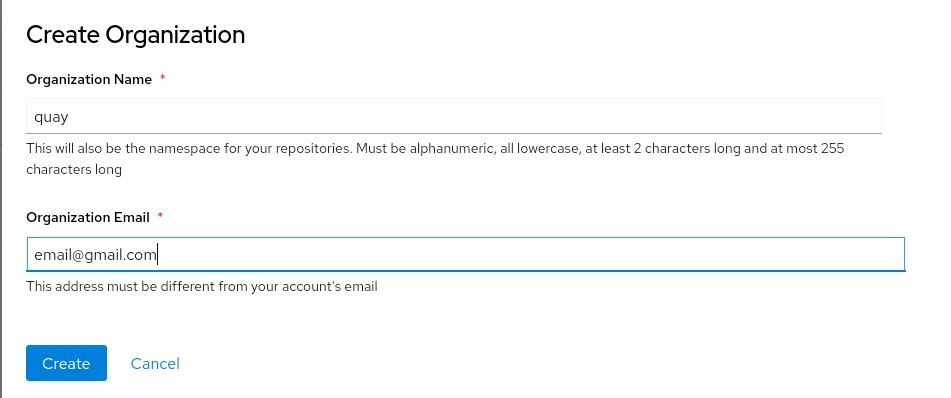
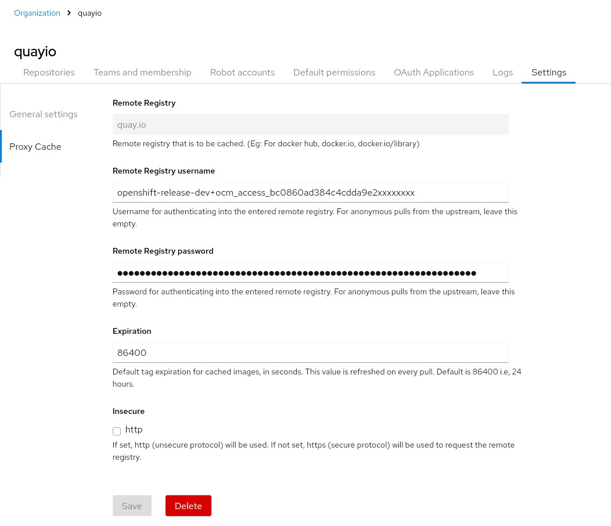
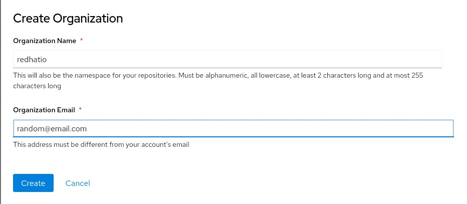
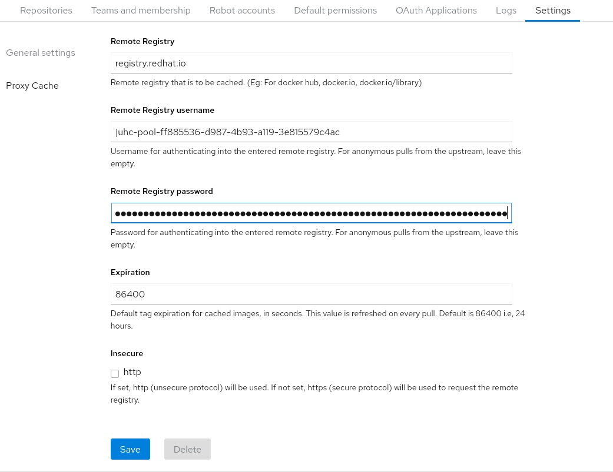

# Disconnected Openshift Installation Using Pull Through Cache Registry Proxy

A disconnected OpenShift installation is typically executed following the mirroring of requisite OpenShift release images, operator images, and other necessary images into a local enterprise registry. This methodology guarantees the preservation of a local image replica within the enterprise registry, but requires continuing the mirroring of new release images for all subsequent update and upgrade procedures.

This necessitates an increase in the registry's storage requirements and heightens the operational burden associated with mirroring new release and operator images and systematically purging redundant images to conserve storage space.

Numerous enterprise registries offer support for pull-through cache functionality. This document aims to outline the requisite procedures for installing a disconnected OpenShift environment by leveraging this specific feature.

## Pre-requisites
* The enterprise registry must be connected to the internet.
* The enterprise registry is mandated to support pull-through cache for upstream registries that require authentication.
* Red Hat Quay will be utilized for this testing. Should an alternative registry be used, the corresponding steps in that registry's documentation must be followed.

## Step 1: Download pull secret from Red Hat website
To facilitate a pull-through cache, the enterprise registry must be able to authenticate with `quay.io` and `registry.redhat.io` to retrieve the requisite images on demand. The initial step involves extracting the necessary credentials from the pull secret.

Download the pull secret from the [Red Hat Console](https://console.redhat.com/openshift/install/pull-secret) and save it to a file named `pull-secret.txt`. Extract the username and password for both `registry.redhat.io` and `quay.io`. In the resulting output, the username and password will be delimited by a colon (`:`). Record this information for use in the subsequent section.

```bash
$ cat pull-secret.txt | jq -r '.auths["quay.io"].auth' | base64 -d
openshift-release-dev+ocm_access_bc0000000000000000000000:XXXXXXXXXXXXXXXXXXXXXXXXXXXXXXXXXXX

$ cat pull-secret.txt | jq -r '.auths["registry.redhat.io"].auth' | base64 -d
uhc-pool-pool-id:XyXyXYYYFYYYYSuuu.....
```

## Step 2: Create Pull through Cache Registry
Setting up Quay to support pull through cache is outside the scope of this document which can be achieved by configuring below during deployment.

```yaml
FEATURE_PROXY_CACHE: true
```

On your enterprise (Quay in our case) registry, configure two different pull through cache repositories, one for `registry.redhat.io` and another for `quay.io`.
This needs two separate Organizations within Red Hat Quay, one for each.

* Create an Organization named `quay`.

* Configure this organization to pull content from the upstream registry, `quay.io`, utilizing the username and password credentials obtained from the preceding section. This needs to be done by clicking on the Organization -> Click on the Org -> Settings -> ProxyCache.

* Create another organization named `redhatio`.

* Configure this organization to pull content from the upstream registry, `registry.redhat.io`, utilizing the username and password credentials obtained from the preceding section. This needs to be done by clicking on the Organization -> Click on Org -> Settings -> ProxyCache.

* Once the setup is complete, using a bastion node, verify pulling images through the cache works. The first part of the image URL must be replaced with the registry-url/suffix. For example, to pull `quay.io/openshift-release-dev/ocp-release:4.20.13-x86_64` from the internal registry using pull through cache, replace `quay.io` with `registry-url/quay` (e.g., `https://<your-registry-url.apps.cluster.domain.com>/quay/openshift-release-dev/ocp-release:4.20.13-x86_64`).

```bash
$ export REGISTRY_URL=<your-registry-url.apps.cluster.domain.com>

$ podman login $REGISTRY_URL

$ podman pull ${REGISTRY_URL}/quay/openshift-release-dev/ocp-release:4.20.13-x86_64

Trying to pull <your-registry-url.apps.cluster.domain.com>/quay/openshift-release-dev/ocp-release:4.20.13-x86_64...
Getting image source signatures
Copying blob c4bf152039e6 done | 
Copying blob 909dec6c8af6 done | 
Copying blob 25c75c34b2e2 done | 
Copying blob 5415dc838943 done | 
Copying blob d15228739a61 done | 
Copying config 2be6ed93f5 done | 
Writing manifest to image destination
2be6ed93f53d0f76f155c3482d0649a8673bb342c03a987d123d25adf38908d7

$ podman images
REPOSITORY                                                                                                       TAG                IMAGE ID      CREATED      SIZE
<your-registry-url.apps.cluster.domain.com>/quay/openshift-release-dev/ocp-release                               4.20.13-x86_64     2be6ed93f53d  5 weeks ago  504 MB
```

* The same way validate an image can be pulled from `registry.redhat.io` as well through cache.

```bash
$ export REGISTRY_URL=<your-registry-url.apps.cluster.domain.com>
$ podman pull ${REGISTRY_URL}/redhatio/rhacm2/acm-cli-rhel9:v2.14

Trying to pull <your-registry-url.apps.cluster.domain.com>/redhatio/rhacm2/acm-cli-rhel9:v2.14...
Getting image source signatures
Copying blob f2d8d3ce6d2d done | 
Copying blob 55c0205b422b done | 
Copying config 71dcedfc70 done | 
Writing manifest to image destination
71dcedfc709d676a413cab172baeec9773794c35c4f81eb9deb2065f22746d67

$ podman images
REPOSITORY                                                                                              TAG    IMAGE ID      CREATED      SIZE
<your-registry-url.apps.cluster.domain.com>/redhatio/rhacm2/acm-cli-rhel9                               v2.14  71dcedfc709d  5 weeks ago  509 MB
```

## Step 3: Extract Required tools through Cache
Utilities such as `openshift-install`, `ccoctl`, and credentials requests can be extracted via pull-through cache. Please follow the subsequent steps.

Create `idms.yaml` below.

```yaml
---
apiVersion: config.openshift.io/v1
kind: ImageDigestMirrorSet
metadata:
  name: idms-release-0
spec:
  imageDigestMirrors:
  - mirrors:
    - $REGISTRY_URL/quay
    source: quay.io
```

Replace `$REGISTRY_URL` with the url of the enterprise registry.

Extract the required utilities via cache. `auth-file.json` must have username and password for the enterprise registry in docker json format.

```bash
$ oc adm release extract -a auth-file.json --idms-file=idms.yaml --command=openshift-install ${REGISTRY_URL}/quay/openshift-release-dev/ocp-release:4.20.13-x86_64

$ oc adm release extract -a auth-file.json --idms-file=idms.yaml --credentials-requests --cloud=aws --to=credrequests ${REGISTRY_URL}/quay/openshift-release-dev/ocp-release:4.20.13-x86_64

$ oc adm release extract -a auth-file.json --idms-file=idms.yaml --command=ccoctl ${REGISTRY_URL}/quay/openshift-release-dev/ocp-release:4.20.13-x86_64
```

## Step 4: Configure install-config.yaml
* Set `pullSecret:` with the credentials to the enterprise registry.
* Update `imageDigestSources:` to point to the enterprise registry replacing `$REGISTRY_URL` appropriately.

```yaml
imageDigestSources:
- mirrors:
  - ${REGISTRY_URL}/quay
  source: quay.io
- mirrors:
  - ${REGISTRY_URL}/redhatio
  source: registry.redhat.io
```

By configuring the system in this manner, there is no need to individually configure Image Digest Mirror Set (IDMS) entries for each operator.

## Step 5: Create the Cluster
Create the cluster using `openshift-install` pointing to the `install-config.yaml` like a normal openshift is deployed. See Appendix III.

## Step 6: Red Hat Certified Operators through cache
Additional steps need to be followed to populate the index image through cache.

* Disable default sources for operator hub:

```bash
$ oc patch OperatorHub cluster --type json -p '[{"op": "add", "path": "/spec/disableAllDefaultSources", "value": true}]'
```

* Create `CatalogSource` as below replace `${REGISTRY_URL}` appropriately pointing to the enterprise cache registry url:

```yaml
apiVersion: operators.coreos.com/v1alpha1
kind: CatalogSource
metadata:
  name: redhat-operators-proxy
  namespace: openshift-marketplace
spec:
  displayName: Red Hat Operators (Proxy Cache)
  publisher: Red Hat
  sourceType: grpc
  image: ${REGISTRY_URL}/redhatio/redhat/redhat-operator-index:v4.20
  updateStrategy:
    registryPoll:
      interval: 24h
```

* Apply it:

```bash
$ oc apply -f <file name>
```

All Red Hat Certified Operators will now be listed in the Catalog and can be installed.

---

## Appendix I: Setup Testing Environment
* Create VPC in AWS using VPC & More, with 3 public and 3 private subnets, S3 GW endpoint and NAT Gateway.
* Create a bastion node to one of the public subnets.
* Install a ROSA cluster to private subnets using Private mode.

## Appendix II: Setup Quay Registry for Pull Through Cache
* Install Quay Operator on the ROSA cluster.
* Create s3 bucket `<your-quay-s3-bucket-name>`.
* Create `config.yaml` secret for Quay Setup. Populate AWS access key and secret key.

```yaml
apiVersion: v1
kind: Secret
metadata:
  name: config-bundle-secret
  namespace: quay-enterprise
stringData:
  config.yaml: |
    FEATURE_RATE_LIMITS: false
    FEATURE_PROXY_CACHE: true
    ALLOW_PULLS_WITHOUT_STRICT_LOGGING: false
    AUTHENTICATION_TYPE: Database
    DEFAULT_TAG_EXPIRATION: 2w
    FEATURE_USER_INITIALIZE: true
    SUPER_USERS:
    - quayadmin
    BROWSER_API_CALLS_XHR_ONLY: false
    FEATURE_USER_CREATION: false
    DISTRIBUTED_STORAGE_CONFIG:
      s3Storage:
      - S3Storage
      - host: s3.<your-aws-region>.amazonaws.com
        s3_access_key: <YOUR_AWS_ACCESS_KEY>
        s3_secret_key: <YOUR_AWS_SECRET_KEY>
        s3_bucket: <your-quay-s3-bucket-name>
        s3_region: <your-aws-region>
        storage_path: /datastorage/registry
    DISTRIBUTED_STORAGE_DEFAULT_LOCATIONS: []
    DISTRIBUTED_STORAGE_PREFERENCE:
    - s3Storage
```

* Create QuayRegistry CR:

```yaml
apiVersion: quay.redhat.com/v1
kind: QuayRegistry
metadata:
  name: quay
  namespace: quay-enterprise
spec:
  configBundleSecret: config-bundle-secret
  components:
  - kind: objectstorage
    managed: false
  - kind: horizontalpodautoscaler
    managed: false
  - kind: clairpostgres
    managed: true
  - kind: tls
    managed: true
  - kind: route
    managed: true
  - kind: postgres
    managed: true
  - kind: redis
    managed: true
  - kind: monitoring
    managed: true
  - kind: mirror
    managed: true
    overrides:
      replicas: 1
  - kind: quay
    managed: true
    overrides:
      replicas: 1
  - kind: clair
    managed: true
    overrides:
      replicas: 1
```

* Populate admin credentials:

```bash
$ export REGISTRY_URL=<your-registry-url.apps.cluster.domain.com>
$ export REGISTRY_PASSWORD=<YOUR_SECURE_PASSWORD>
$ export REGISTRY_EMAIL=<your-email@example.com>
$ curl -X POST -k https://$REGISTRY_URL/api/v1/user/initialize --header 'Content-Type: application/json' --data '{ "username": "quayadmin", "password":"$REGISTRY_PASSWORD", "email": "$REGISTRY_EMAIL", "access_token": true}'
```

## Appendix III: Setup Infrastructure for Disconnected Cluster
* Create three more private subnets in the same vpc.
* Add a route to the s3 GW endpoint in the route table for these subnets.
* Do not add a route to NAT GW for these subnets so it will not have internet connections.
* Create private interface endpoints or ec2, elasticloadbalancing and sts so these clusters can connect to those APIs.
* Deploy the disconnected cluster pointing to the pull through cache mirror into these subnets. Eg `install-config.yaml`:

```yaml
apiVersion: v1
baseDomain: <your-base-domain.com>
credentialsMode: Manual
compute:
- architecture: amd64
  hyperthreading: Enabled
  name: worker
  platform: {}
  replicas: 3
controlPlane:
  architecture: amd64
  hyperthreading: Enabled
  name: master
  platform: {}
  replicas: 3
metadata:
  creationTimestamp: null
  name: cluster1
networking:
  clusterNetwork:
  - cidr: 10.128.0.0/14
    hostPrefix: 23
  machineNetwork:
  - cidr: 10.0.0.0/16
  networkType: OVNKubernetes
  serviceNetwork:
  - 172.30.0.0/16
platform:
  aws:
    region: <your-aws-region>
    subnets:
    - subnet-<id-1>
    - subnet-<id-2>
    - subnet-<id-3>
    hostedZone: <YOUR_HOSTED_ZONE_ID>
publish: Internal
pullSecret: '{"auths":{"<your-registry-url>": {"auth": "<credential-to-quay-pull-through-cache>"} }}'
imageDigestSources:
- mirrors:
  - <your-registry-url>/quay
  source: quay.io
- mirrors:
  - <your-registry-url>/redhatio
  source: registry.redhat.io
sshKey: |
  ssh-rsa <YOUR_SSH_PUBLIC_KEY>
```

* **Note:** Customization to manifests is required to remove hosted zone id and manually create entries in Route53 in AWS for `*.apps` for installation to finish.