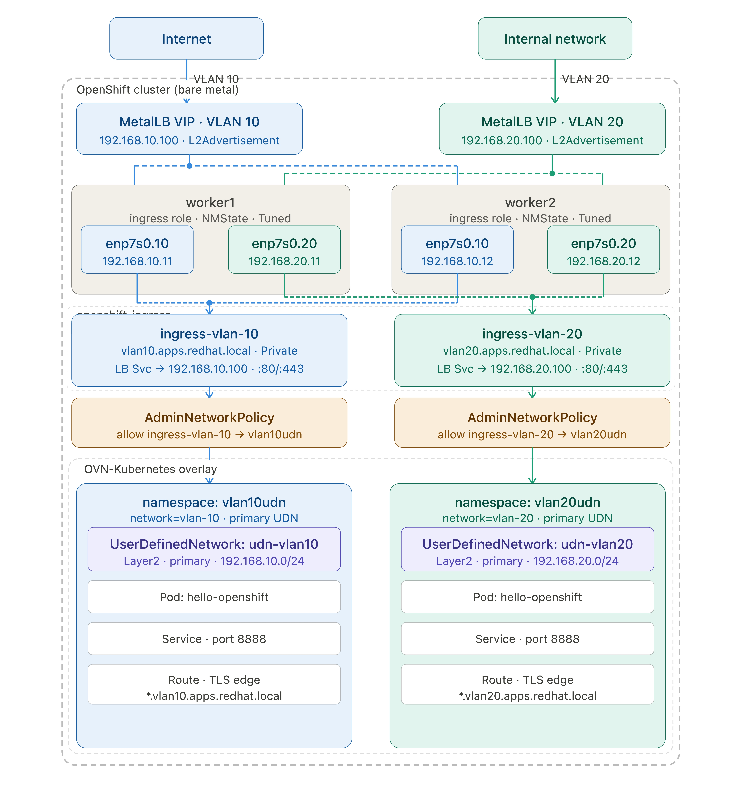

# OpenShift Dual-VLAN Ingress with MetalLB and UDN

This repository contains the complete configuration for a high-availability, dual-VLAN ingress architecture on bare-metal OpenShift. It utilizes **MetalLB** for LoadBalancer VIPs and **NMState** for host-level networking and kernel tuning. The goal is to facilitate traffic from two different VLANs to be served by two different Ingress Controllers. The traffic comes from one vlan segment originates from Internet and another vlan segment originates from internal network and they target different set of workloads within openshift that run on different primary UDNs.

Find below the network diagram to visualize it.


## 1. Label your Ingress Nodes

```bash
oc label node worker1 node-role.kubernetes.io/ingress=""
oc label node worker2 node-role.kubernetes.io/ingress=""
```

## 2. Install and Initialize Operators
Install the **NMState** and **MetalLB** Operators from the OpenShift OperatorHub. Once installed, apply this manifest to initialize the required background daemons:

```yaml
cat <<EOF > 01-init.yaml
apiVersion: nmstate.io/v1
kind: NMState
metadata:
  name: nmstate
---
apiVersion: metallb.io/v1beta1
kind: MetalLB
metadata:
  name: metallb
  namespace: metallb-system
EOF
```
- Apply it.
```bash
oc apply -f 01-init.yaml
```

## 3. Node Network Configuration (NMState)
Configure physical VLAN interfaces on the worker nodes.

- Worker 1 Policy. Make changes based on your environment for base interface name, ip addresses and vlan ids.
```yaml
cat <<EOF > 02-nncp-worker1.yaml
apiVersion: nmstate.io/v1
kind: NodeNetworkConfigurationPolicy
metadata:
  name: vlan-static-worker1
spec:
  nodeSelector:
    kubernetes.io/hostname: "worker1"
  desiredState:
    interfaces:
      - name: enp7s0.10
        type: vlan
        state: up
        vlan: 
          base-iface: enp7s0
          id: 10
        ipv4:
          enabled: true
          dhcp: false
          address: 
            - ip: 192.168.10.11
              prefix-length: 24
      - name: enp7s0.20
        type: vlan
        state: up
        vlan: 
          base-iface: enp7s0
          id: 20
        ipv4:
          enabled: true
          dhcp: false
          address: 
            - ip: 192.168.20.11
              prefix-length: 24
EOF
```
- Apply it.
```bash
oc apply -f 02-nncp-worker1.yaml
```
- Worker 2 Policy. Make changes based on your environment for base interface name, ip addresses and vlan ids.
```yaml
cat <<EOF > 03-nncp-worker2.yaml
apiVersion: nmstate.io/v1
kind: NodeNetworkConfigurationPolicy
metadata:
  name: vlan-static-worker2
spec:
  nodeSelector:
    kubernetes.io/hostname: "worker2"
  desiredState:
    interfaces:
      - name: enp7s0.10
        type: vlan
        state: up
        vlan: 
          base-iface: enp7s0
          id: 10
        ipv4:
          enabled: true
          dhcp: false
          address: 
            - ip: 192.168.10.12
              prefix-length: 24
      - name: enp7s0.20
        type: vlan
        state: up
        vlan: 
          base-iface: enp7s0
          id: 20
        ipv4:
          enabled: true
          dhcp: false
          address: 
            - ip: 192.168.20.12
              prefix-length: 24
EOF
```
- Apply it.
```bash
oc apply -f 03-nncp-worker2.yaml
```
## 4. Apply Tuned Profile to enable ip_forwarding, rp_Filter    

```yaml
cat <<EOF > 04-tuned.yaml
apiVersion: tuned.openshift.io/v1
kind: Tuned
metadata:
  name: ingress-kernel-tuning
  namespace: openshift-cluster-node-tuning-operator
spec:
  profile:
  - name: ingress-forwarding
    data: |
      [sysctl]
      net.ipv4.ip_forward=1
      net.ipv4.conf.all.forwarding=1
      net.ipv4.conf.all.rp_filter=2
  recommend:
  - priority: 20
    profile: ingress-forwarding
    operand:
      nodeSelector:
        node-role.kubernetes.io/ingress: ""
EOF
```
- Apply it.
```bash
oc apply -f 04-tuned.yaml
```

## 5. MetalLB LoadBalancer Configuration
Define the virtual IP pools and L2 advertisements. The nodeSelectors ensure MetalLB only announces VIPs from nodes physically connected to the VLAN trunk.

- For VLAN 10

```yaml
cat <<EOF > 05-metallb-config.yaml
apiVersion: metallb.io/v1beta1
kind: IPAddressPool
metadata:
  name: vlan-10-pool
  namespace: metallb-system
spec:
  addresses: ["192.168.10.100-192.168.10.105"]
  autoAssign: true
---
apiVersion: metallb.io/v1beta1
kind: L2Advertisement
metadata:
  name: vlan-10-adv
  namespace: metallb-system
spec:
  ipAddressPools: 
    - vlan-10-pool
  interfaces: 
    - enp7s0.10
  nodeSelectors: 
    - matchLabels: 
        node-role.kubernetes.io/ingress: ""
EOF
```
- Apply it.
```bash
oc apply -f 05-metallb-config.yaml
```
- For VLAN 20

```yaml
cat <<EOF > 06-metallb-config.yaml
apiVersion: metallb.io/v1beta1
kind: IPAddressPool
metadata:
  name: vlan-20-pool
  namespace: metallb-system
spec:
  addresses: ["192.168.20.100-192.168.20.105"]
  autoAssign: true
---
apiVersion: metallb.io/v1beta1
kind: L2Advertisement
metadata:
  name: vlan-20-adv
  namespace: metallb-system
spec:
  ipAddressPools: 
    - vlan-20-pool
  interfaces: 
    - enp7s0.20
  nodeSelectors: 
    - matchLabels: 
        node-role.kubernetes.io/ingress: ""
EOF
```
- Apply it.
```bash
oc apply -f 06-metallb-config.yaml
```
## 6. Ingress Controller Sharding
Deploy custom Ingress Controllers.

- VLAN 10 Ingress Controller.
```yaml
cat <<EOF > 07-ingress-vlan10.yaml
apiVersion: operator.openshift.io/v1
kind: IngressController
metadata:
  name: ingress-vlan-10
  namespace: openshift-ingress-operator
spec:
  domain: vlan10.apps.redhat.local
  replicas: 2
  endpointPublishingStrategy:
    type: Private
  nodePlacement:
    nodeSelector:
      matchLabels: 
        node-role.kubernetes.io/ingress: ""
  namespaceSelector:
    matchLabels: 
      network: vlan-10
EOF
```
- Apply it.
```bash
oc apply -f 07-ingress-vlan10.yaml
```
- Create service manually.
```yaml
cat <<EOF > 08-ingress-vlan10-service.yaml
apiVersion: v1
kind: Service
metadata:
  name: manual-vlan-10-ingress
  namespace: openshift-ingress
  annotations:
    metallb.universe.tf/address-pool: vlan-10-pool
    metallb.universe.tf/loadBalancerIPs: 192.168.10.100
spec:
  type: LoadBalancer
  externalTrafficPolicy: Cluster
  selector:
    ingresscontroller.operator.openshift.io/deployment-ingresscontroller: ingress-vlan-10
  ports:
  - name: http
    protocol: TCP
    port: 80
    targetPort: 80
  - name: https
    protocol: TCP
    port: 443
    targetPort: 443
EOF
```
- Apply it
```bash
oc apply -f 08-ingress-vlan10-service.yaml
```
- VLAN 20 Ingress Controller.
```yaml
cat <<EOF > 08-ingress-vlan20.yaml
apiVersion: operator.openshift.io/v1
kind: IngressController
metadata:
  name: ingress-vlan-20
  namespace: openshift-ingress-operator
spec:
  domain: vlan20.apps.redhat.local
  replicas: 2
  endpointPublishingStrategy:
    type: Private
  nodePlacement:
    nodeSelector:
      matchLabels: 
        node-role.kubernetes.io/ingress: ""
  namespaceSelector:
    matchLabels: 
      network: vlan-20
EOF
```
- Apply it
```bash
oc apply -f 08-ingress-vlan20.yaml
```
- Create service manually.
```yaml
cat <<EOF > 09-ingress-vlan20-service.yaml
apiVersion: v1
kind: Service
metadata:
  name: manual-vlan-20-ingress
  namespace: openshift-ingress
  annotations:
    metallb.universe.tf/address-pool: vlan-20-pool
    metallb.universe.tf/loadBalancerIPs: 192.168.20.100
spec:
  type: LoadBalancer
  externalTrafficPolicy: Cluster
  selector:
    ingresscontroller.operator.openshift.io/deployment-ingresscontroller: ingress-vlan-20
  ports:
  - name: http
    protocol: TCP
    port: 80
    targetPort: 80
  - name: https
    protocol: TCP
    port: 443
    targetPort: 443
EOF
```
- Apply it
```bash
oc apply -f 09-ingress-vlan20-service.yaml
```
## 7. Prevent VLAN routes on default IngressController
Prevent the default ingress controller from intercepting VLAN routes:

```bash
oc patch ingresscontroller default -n openshift-ingress-operator --type=merge -p '{"spec":{"namespaceSelector":{"matchExpressions":[{"key":"network","operator":"DoesNotExist"}]}}}'
```
## 8. Testing 
###  Vlan 10
Deploy Sample App & Create Route:

1. Create a namespace and label it.
```yaml
cat << EOF > 10-namespace.yaml
apiVersion: v1
kind: Namespace
metadata:
  name: vlan10udn
  labels:
    k8s.ovn.org/primary-user-defined-network: ""
    network: vlan-10
EOF
```
- Apply it
```bash
oc apply -f 10-namespace.yaml
```
2. Create UDN Network to map to vlan10.
```yaml
cat << EOF > 11-udn-vlan10.yaml
apiVersion: k8s.ovn.org/v1
kind: UserDefinedNetwork
metadata:
  name: udn-vlan10
  namespace: vlan10udn
spec:
  topology: Layer2
  layer2:
    role: Primary
    subnets:
      - "172.16.10.0/24"
EOF
```
- Apply it
```bash
oc apply -f 11-udn-vlan10.yaml
```
3. Create AdminNetworkPolicy to allow from vlan10 pods in Ingress namespace to UDN namespace.
```yaml
cat << EOF > 12-anp.yaml
apiVersion: policy.networking.k8s.io/v1alpha1
kind: AdminNetworkPolicy
metadata:
  name: allow-ingress-vlan10-to-udn-1
spec:
  priority: 10
  subject:
    namespaces:
      matchLabels:
        network-group: udn-vlan10
  ingress:
    - name: "allow-only-vlan-10-ingress"
      action: "Allow"
      from:
        - pods:
            namespaceSelector:
              matchLabels:
                kubernetes.io/metadata.name: openshift-ingress
            podSelector:
              matchLabels:
                ingresscontroller.operator.openshift.io/deployment-ingresscontroller: ingress-vlan-10
EOF
```
- Apply it
```bash
oc apply -f 12-anp.yaml
```
2. Create test hello-openshift application.
```yaml
cat <<EOF > 13-hello-openshift.yaml
apiVersion: v1
kind: Pod
metadata:
  name: hello-openshift
  namespace: vlan10udn
  labels:
    app: hello-openshift
spec:
  containers:
    - name: hello-openshift
      image: quay.io/openshift/origin-hello-openshift
      ports:
        - containerPort: 8888
      securityContext:
        privileged: false
        allowPrivilegeEscalation: false
        runAsNonRoot: true
        runAsUser: 1001
        capabilities:
          drop:
            - ALL
        seccompProfile:
          type: RuntimeDefault
---
kind: Service
apiVersion: v1
metadata:
  name: hello-openshift-service
  namespace: vlan10udn
  labels:
    app: hello-openshift
spec:
  selector:
    app: hello-openshift
  ports:
    - port: 8888
EOF
```
- Apply it
```bash
oc apply -f 13-hello-openshift.yaml
```

3. Create route and label it for the VLAN 10 shard
```yaml
cat <<EOF > 14-hello-openshift-route.yaml
apiVersion: route.openshift.io/v1
kind: Route
metadata:
  name: hello-openshift
  namespace: vlan10udn
spec:
  host: hello-openshiftudn.vlan10.apps.redhat.local
  to:
    kind: Service
    name: hello-openshift-service
  tls:
    termination: edge
EOF
```
- Apply it
```bash
oc apply -f 14-hello-openshift-route.yaml
```
4. Verify Connectivity from External RHEL Host:

```bash
# 1. Test ARP (L2)
arping -I eth1.10 192.168.10.100

# 2. Test Connection (L4/L7)
curl -v -k --resolve hello-openshift.vlan10.apps.redhat.local:443:192.168.10.100 https://hello-openshift.vlan10.apps.redhat.local
```
### Vlan 20
Deploy Sample App & Create Route:

1. Create a test project vlan20udn and label it.
```bash
cat << EOF > 14-namespace.yaml
apiVersion: v1
kind: Namespace
metadata:
  name: vlan20udn
  labels:
    k8s.ovn.org/primary-user-defined-network: ""
    network: vlan-20
EOF
```
- Apply it
```bash
oc apply -f 14-namespace.yaml
```
2. Create UDN Network to map to vlan20.
```yaml
cat << EOF > 15-udn-vlan20.yaml
apiVersion: k8s.ovn.org/v1
kind: UserDefinedNetwork
metadata:
  name: udn-vlan20
  namespace: vlan20udn
spec:
  topology: Layer2
  layer2:
    role: Primary
    subnets:
      - "172.16.20.0/24"
EOF
```
- Apply it
```bash
oc apply -f 15-udn-vlan20.yaml
```
3. Create AdminNetworkPolicy to allow from vlan20 pods in Ingress namespace to UDN namespace.
```yaml
cat << EOF > 16-anp.yaml
apiVersion: policy.networking.k8s.io/v1alpha1
kind: AdminNetworkPolicy
metadata:
  name: allow-ingress-vlan20-to-udn-1
spec:
  priority: 10
  subject:
    namespaces:
      matchLabels:
        network-group: udn-vlan20
  ingress:
    - name: "allow-only-vlan-20-ingress"
      action: "Allow"
      from:
        - pods:
            namespaceSelector:
              matchLabels:
                kubernetes.io/metadata.name: openshift-ingress
            podSelector:
              matchLabels:
                ingresscontroller.operator.openshift.io/deployment-ingresscontroller: ingress-vlan-20
```
- Apply it
```bash
oc apply -f 16-anp.yaml
```
2. Create test hello-openshift application.
```yaml
cat <<EOF > 17-hello-openshift.yaml
apiVersion: v1
kind: Pod
metadata:
  name: hello-openshift
  namespace: vlan20udn
  labels:
    app: hello-openshift
spec:
  containers:
    - name: hello-openshift
      image: quay.io/openshift/origin-hello-openshift
      ports:
        - containerPort: 8888
      securityContext:
        privileged: false
        allowPrivilegeEscalation: false
        runAsNonRoot: true
        runAsUser: 1001
        capabilities:
          drop:
            - ALL
        seccompProfile:
          type: RuntimeDefault
---
kind: Service
apiVersion: v1
metadata:
  name: hello-openshift-service
  namespace: vlan20udn
  labels:
    app: hello-openshift
spec:
  selector:
    app: hello-openshift
  ports:
    - port: 8888
EOF
```
- Apply it
```bash
oc apply -f 17-hello-openshift.yaml
```

3. Create route and label it for the VLAN 10 shard
```yaml
cat <<EOF > 18-hello-openshift-route.yaml
apiVersion: route.openshift.io/v1
kind: Route
metadata:
  name: hello-openshift
  namespace: vlan20udn
spec:
  host: hello-openshiftudn.vlan20.apps.redhat.local
  to:
    kind: Service
    name: hello-openshift-service
  tls:
    termination: edge
EOF
```
- Apply it
```bash
oc apply -f 18-hello-openshift-route.yaml
```
4. Verify Connectivity from External RHEL Host:

```bash
# 1. Test ARP (L2)
arping -I eth1.20 192.168.20.100

# 2. Test Connection (L4/L7)
curl -v -k --resolve hello-openshiftudn.vlan20.apps.redhat.local:443:192.168.20.100 https://hello-openshiftudn.vlan20.apps.redhat.local
```
## 9. Test Results
Testing shows this is not working as expected. The goal was to have two separate ingress controllers for two different VLANs and serve traffic from two different VLANs to two different namespaces where pods in each namespaces is connected to two different UDNs.

- Even through the pod has UDN primary network, it's still connected to normal openshift pod network.
```bash
# oc rsh hello-openshift
# ip a
1: lo: <LOOPBACK,UP,LOWER_UP> mtu 65536 qdisc noqueue state UNKNOWN group default qlen 1000
    link/loopback 00:00:00:00:00:00 brd 00:00:00:00:00:00
    inet 127.0.0.1/8 scope host lo
       valid_lft forever preferred_lft forever
    inet6 ::1/128 scope host 
       valid_lft forever preferred_lft forever
2: eth0@if66: <BROADCAST,MULTICAST,UP,LOWER_UP> mtu 1400 qdisc noqueue state UP group default 
    link/ether 0a:58:0a:83:00:2d brd ff:ff:ff:ff:ff:ff link-netnsid 0
    inet 10.131.0.45/23 brd 10.131.1.255 scope global eth0
       valid_lft forever preferred_lft forever
    inet6 fe80::858:aff:fe83:2d/64 scope link 
       valid_lft forever preferred_lft forever
3: ovn-udn1@if67: <BROADCAST,MULTICAST,UP,LOWER_UP> mtu 1400 qdisc noqueue state UP group default 
    link/ether 0a:58:c0:a8:0a:04 brd ff:ff:ff:ff:ff:ff link-netnsid 0
    inet 172.16.10.4/24 brd 172.16.10.255 scope global ovn-udn1
       valid_lft forever preferred_lft forever
    inet6 fe80::858:c0ff:fea8:a04/64 scope link 
       valid_lft forever preferred_lft forever
```
- This is expected. The goal of UDN is only east-west traffic. So the default route will be UDN network.
```bash
# ip r
default via 172.16.10.1 dev ovn-udn1 
10.128.0.0/14 via 10.131.0.1 dev eth0 
10.131.0.0/23 dev eth0 proto kernel scope link src 10.131.0.45 
100.64.0.0/16 via 10.131.0.1 dev eth0 
100.65.0.0/16 via 172.16.10.1 dev ovn-udn1 
172.30.0.0/16 via 172.16.10.1 dev ovn-udn1 
172.16.10.0/24 dev ovn-udn1 proto kernel scope link src 172.16.10.4 
```
- When Ingress Controller was configured, it did not use the UDN IP to forward to the pod. Instead it used the normal openshift pod network IP.

```bash
# oc project openshift-ingress
# oc rsh router-ingress-vlan-10-55985cf77c-k8z76
# cat /var/lib/haproxy/conf/os_edge_reencrypt_be.map 

^hello-openshiftudn\.vlan10\.apps\.redhat\.local\.?(:[0-9]+)?(/.*)?$ be_edge_http:vlan10udn:hello-openshift

# cat /var/lib/haproxy/conf/haproxy.config

backend be_edge_http:vlan10udn:hello-openshift
  mode http
  option redispatch
  option forwardfor
  balance random

  timeout check 5000ms
  http-request add-header X-Forwarded-Host %[req.hdr(host)]
  http-request add-header X-Forwarded-Port %[dst_port]
  http-request add-header X-Forwarded-Proto http if !{ ssl_fc }
  http-request add-header X-Forwarded-Proto https if { ssl_fc }
  http-request add-header X-Forwarded-Proto-Version h2 if { ssl_fc_alpn -i h2 }
  http-request add-header Forwarded for=%[src];host=%[req.hdr(host)];proto=%[req.hdr(X-Forwarded-Proto)]
  cookie f0faccc626b5998fa4d16100e00fa863 insert indirect nocache httponly secure attr SameSite=None
  server pod:hello-openshift:hello-openshift-service::10.131.0.45:8888 10.131.0.45:8888 cookie 85d77b1b01181b511a06f8afb8cd7e1d weight 1
```
- This means the router pods still uses the pod primary network IP to forward traffic to. Not UDN IP.

## 10. Conclusion
If your security mandate dictates that Ingress traffic must flow to the UDN 172.16.10.x IP and completely bypass the OpenShift default network, you cannot use the native OpenShift IngressController or Route API. Native routes are fundamentally hardwired to use the eth0 cluster IP.

