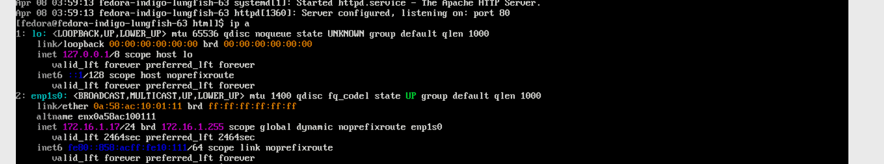

# OpenShift Dual-VLAN Ingress with MetalLB and CUDN

This repository contains the complete configuration for a high-availability, dual-VLAN ingress architecture on bare-metal OpenShift. It utilizes **MetalLB** for LoadBalancer VIPs and **NMState** for host-level networking and kernel tuning. The goal is to facilitate traffic from two different VLANs to be served by two different MetalLB Pools tagged directly on the physical interface. The traffic comes from one vlan segment originates from Internet and another vlan segment originates from internal network and they target different set of workloads within openshift that run on different primary CUDNs.

Find below the network diagram to visualize it.


## 1. Label your Ingress Nodes

```bash
oc label node worker1 node-role.kubernetes.io/ingress=""
oc label node worker2 node-role.kubernetes.io/ingress=""
```

## 2. Install and Initialize Operators
Install the **NMState** and **MetalLB** Operators from the OpenShift OperatorHub. Once installed, apply this manifest to initialize the required background daemons:

```yaml
cat <<EOF > 01-init.yaml
apiVersion: nmstate.io/v1
kind: NMState
metadata:
  name: nmstate
---
apiVersion: metallb.io/v1beta1
kind: MetalLB
metadata:
  name: metallb
  namespace: metallb-system
EOF
```
- Apply it.
```bash
oc apply -f 01-init.yaml
```

## 3. Node Network Configuration (NMState)
Configure physical VLAN interfaces on the worker nodes.

- Worker 1 Policy. Make changes based on your environment for base interface name, ip addresses and vlan ids.
```yaml
cat <<EOF > 02-nncp-worker1.yaml
apiVersion: nmstate.io/v1
kind: NodeNetworkConfigurationPolicy
metadata:
  name: vlan-static-worker1
spec:
  nodeSelector:
    kubernetes.io/hostname: "worker1"
  desiredState:
    interfaces:
      - name: enp7s0.10
        type: vlan
        state: up
        vlan: 
          base-iface: enp7s0
          id: 10
        ipv4:
          enabled: true
          dhcp: false
          address: 
            - ip: 192.168.10.11
              prefix-length: 24
      - name: enp7s0.20
        type: vlan
        state: up
        vlan: 
          base-iface: enp7s0
          id: 20
        ipv4:
          enabled: true
          dhcp: false
          address: 
            - ip: 192.168.20.11
              prefix-length: 24
EOF
```
- Apply it.
```bash
oc apply -f 02-nncp-worker1.yaml
```
- Worker 2 Policy. Make changes based on your environment for base interface name, ip addresses and vlan ids.
```yaml
cat <<EOF > 03-nncp-worker2.yaml
apiVersion: nmstate.io/v1
kind: NodeNetworkConfigurationPolicy
metadata:
  name: vlan-static-worker2
spec:
  nodeSelector:
    kubernetes.io/hostname: "worker2"
  desiredState:
    interfaces:
      - name: enp7s0.10
        type: vlan
        state: up
        vlan: 
          base-iface: enp7s0
          id: 10
        ipv4:
          enabled: true
          dhcp: false
          address: 
            - ip: 192.168.10.12
              prefix-length: 24
      - name: enp7s0.20
        type: vlan
        state: up
        vlan: 
          base-iface: enp7s0
          id: 20
        ipv4:
          enabled: true
          dhcp: false
          address: 
            - ip: 192.168.20.12
              prefix-length: 24
EOF
```
- Apply it.
```bash
oc apply -f 03-nncp-worker2.yaml
```
## 4. Apply Tuned Profile to enable ip_forwarding, rp_Filter    

```yaml
cat <<EOF > 04-tuned.yaml
apiVersion: tuned.openshift.io/v1
kind: Tuned
metadata:
  name: ingress-kernel-tuning
  namespace: openshift-cluster-node-tuning-operator
spec:
  profile:
  - name: ingress-forwarding
    data: |
      [sysctl]
      net.ipv4.ip_forward=1
      net.ipv4.conf.all.forwarding=1
      net.ipv4.conf.all.rp_filter=2
  recommend:
  - priority: 20
    profile: ingress-forwarding
    operand:
      nodeSelector:
        node-role.kubernetes.io/ingress: ""
EOF
```
- Apply it.
```bash
oc apply -f 04-tuned.yaml
```

## 5. MetalLB LoadBalancer Configuration
Define the virtual IP pools and L2 advertisements. The nodeSelectors ensure MetalLB only announces VIPs from nodes physically connected to the VLAN trunk.

- For VLAN 10

```yaml
cat <<EOF > 05-metallb-config.yaml
apiVersion: metallb.io/v1beta1
kind: IPAddressPool
metadata:
  name: vlan-10-pool
  namespace: metallb-system
spec:
  addresses: ["192.168.10.100-192.168.10.105"]
  autoAssign: true
---
apiVersion: metallb.io/v1beta1
kind: L2Advertisement
metadata:
  name: vlan-10-adv
  namespace: metallb-system
spec:
  ipAddressPools: 
    - vlan-10-pool
  interfaces: 
    - enp7s0.10
  nodeSelectors: 
    - matchLabels: 
        node-role.kubernetes.io/ingress: ""
EOF
```
- Apply it.
```bash
oc apply -f 05-metallb-config.yaml
```
- For VLAN 20

```yaml
cat <<EOF > 06-metallb-config.yaml
apiVersion: metallb.io/v1beta1
kind: IPAddressPool
metadata:
  name: vlan-20-pool
  namespace: metallb-system
spec:
  addresses: ["192.168.20.100-192.168.20.105"]
  autoAssign: true
---
apiVersion: metallb.io/v1beta1
kind: L2Advertisement
metadata:
  name: vlan-20-adv
  namespace: metallb-system
spec:
  ipAddressPools: 
    - vlan-20-pool
  interfaces: 
    - enp7s0.20
  nodeSelectors: 
    - matchLabels: 
        node-role.kubernetes.io/ingress: ""
EOF
```
- Apply it.
```bash
oc apply -f 06-metallb-config.yaml
```

## 7. Testing 
###  Vlan 10
Deploy Sample App and MetalLB Service

1. Create two new namespaces and label it.
```yaml
cat << EOF > 10-namespace.yaml
apiVersion: v1
kind: Namespace
metadata:
  name: vlan10cudn1
  labels:
    k8s.ovn.org/primary-user-defined-network: ""
    network: vlan10cudn
---
apiVersion: v1
kind: Namespace
metadata:
  name: vlan10cudn2
  labels:
    k8s.ovn.org/primary-user-defined-network: ""
    network: vlan10cudn
EOF
```
- Apply it
```bash
oc apply -f 10-namespace.yaml
```
2. Create CUDN Network to map to vlan10.
```yaml
cat << EOF > 11-cudn-vlan10.yaml
apiVersion: k8s.ovn.org/v1
kind: ClusterUserDefinedNetwork
metadata:
  name: vlan10-cudn
spec:
  namespaceSelector:
    matchLabels:
      network: vlan10cudn
  network:
    topology: Layer2
    layer2:
      role: Primary
      subnets:
        - "172.16.1.0/24"
EOF
```
- Apply it
```bash
oc apply -f 11-cudn-vlan10.yaml
```
3. Create test hello-openshift application to first namespace.
```yaml
cat <<EOF > 13-hello-openshift.yaml
apiVersion: v1
kind: Pod
metadata:
  name: hello-openshift
  namespace: vlan10cudn1
  labels:
    app: hello-openshift
spec:
  containers:
    - name: hello-openshift
      image: quay.io/openshift/origin-hello-openshift
      ports:
        - containerPort: 8888
      securityContext:
        privileged: false
        allowPrivilegeEscalation: false
        runAsNonRoot: true
        runAsUser: 1001
        capabilities:
          drop:
            - ALL
        seccompProfile:
          type: RuntimeDefault
EOF
```
- Apply it
```bash
oc apply -f 13-hello-openshift.yaml
```
4. Create MetalLB Service
```yaml
cat <<EOF > 12-metallb-service.yaml
apiVersion: v1
kind: Service
metadata:
  name: hello-openshift-service
  namespace: vlan10cudn1
  labels:
    app: hello-openshift
  annotations:
    metallb.universe.tf/loadBalancerIPs: 192.168.10.102
spec:
  type: LoadBalancer 
  selector:
    app: hello-openshift
  ports:
    - port: 80
      targetPort: 8888
EOF
```
- Apply it
```bash
oc apply -f 12-metallb-service.yaml
```
5. Create test hello-openshift application to second namespace.
```yaml
cat <<EOF > 14-hello-openshift.yaml
apiVersion: v1
kind: Pod
metadata:
  name: hello-openshift
  namespace: vlan10cudn2
  labels:
    app: hello-openshift
spec:
  containers:
    - name: hello-openshift
      image: quay.io/openshift/origin-hello-openshift
      ports:
        - containerPort: 8888
      securityContext:
        privileged: false
        allowPrivilegeEscalation: false
        runAsNonRoot: true
        runAsUser: 1001
        capabilities:
          drop:
            - ALL
        seccompProfile:
          type: RuntimeDefault
EOF
```
- Apply it
```bash
oc apply -f 14-hello-openshift.yaml
```
6. Create MetalLB Service
```yaml
cat <<EOF > 15-metallb-service.yaml
apiVersion: v1
kind: Service
metadata:
  name: hello-openshift-service
  namespace: vlan10cudn2
  labels:
    app: hello-openshift
  annotations:
    metallb.universe.tf/loadBalancerIPs: 192.168.10.103
spec:
  type: LoadBalancer 
  selector:
    app: hello-openshift
  ports:
    - port: 80
      targetPort: 8888
EOF
```
- Apply it
```bash
oc apply -f 15-metallb-service.yaml
```
7. Verify Connectivity from External RHEL Host:

```bash
# 1. Test ARP (L2)
arping -I eth1.10 192.168.10.102
arping -I eth1.10 192.168.10.103

# 2. Test Connection (L4/L7)
curl -v -k --resolve hello-openshiftcudn1.vlan10.apps.redhat.local:443:192.168.10.102 http://hello-openshiftcudn1.vlan10.apps.redhat.local
curl -v -k --resolve hello-openshiftcudn2.vlan10.apps.redhat.local:443:192.168.10.103 http://hello-openshiftcudn2.vlan10.apps.redhat.local
```
### Vlan 20
Deploy Sample App & Create Route:

1. Create a test project vlan20udn and label it.
```yaml
cat << EOF > 16-namespace.yaml
apiVersion: v1
kind: Namespace
metadata:
  name: vlan20cudn1
  labels:
    k8s.ovn.org/primary-user-defined-network: ""
    network: vlan20cudn
---
apiVersion: v1
kind: Namespace
metadata:
  name: vlan20cudn2
  labels:
    k8s.ovn.org/primary-user-defined-network: ""
    network: vlan20cudn
EOF
```
- Apply it
```bash
oc apply -f 16-namespace.yaml
```
2. Create UDN Network to map to vlan20.
```yaml
cat << EOF > 17-udn-vlan20.yaml
apiVersion: k8s.ovn.org/v1
kind: ClusterUserDefinedNetwork
metadata:
  name: vlan20-cudn
spec:
  namespaceSelector:
    matchLabels:
      network: vlan20cudn
  network:
    topology: Layer2
    layer2:
      role: Primary
      subnets:
        - "172.16.2.0/24"
EOF
```
- Apply it
```bash
oc apply -f 17-udn-vlan20.yaml
```
3. Create test hello-openshift application.
```yaml
cat <<EOF > 18-hello-openshift.yaml
apiVersion: v1
kind: Pod
metadata:
  name: hello-openshift
  namespace: vlan20cudn1
  labels:
    app: hello-openshift
spec:
  containers:
    - name: hello-openshift
      image: quay.io/openshift/origin-hello-openshift
      ports:
        - containerPort: 8888
      securityContext:
        privileged: false
        allowPrivilegeEscalation: false
        runAsNonRoot: true
        runAsUser: 1001
        capabilities:
          drop:
            - ALL
        seccompProfile:
          type: RuntimeDefault
EOF
```
- Apply it
```bash
oc apply -f 18-hello-openshift.yaml
```
4. Create MetalLB Service
```yaml
cat <<EOF > 19-metallb-service.yaml
apiVersion: v1
kind: Service
metadata:
  name: hello-openshift-service
  namespace: vlan20cudn1
  labels:
    app: hello-openshift
  annotations:
    metallb.universe.tf/loadBalancerIPs: 192.168.20.104 
spec:
  type: LoadBalancer 
  selector:
    app: hello-openshift
  ports:
    - port: 80
      targetPort: 8888
EOF
```
- Apply it
```bash
oc apply -f 19-metallb-service.yaml
```
5. Create test hello-openshift application to second namespace.
```yaml
cat <<EOF > 20-hello-openshift.yaml
apiVersion: v1
kind: Pod
metadata:
  name: hello-openshift
  namespace: vlan20cudn2
  labels:
    app: hello-openshift
spec:
  containers:
    - name: hello-openshift
      image: quay.io/openshift/origin-hello-openshift
      ports:
        - containerPort: 8888
      securityContext:
        privileged: false
        allowPrivilegeEscalation: false
        runAsNonRoot: true
        runAsUser: 1001
        capabilities:
          drop:
            - ALL
        seccompProfile:
          type: RuntimeDefault
EOF
```
- Apply it
```bash
oc apply -f 20-hello-openshift.yaml
```
6. Create MetalLB Service
```yaml
cat <<EOF > 21-metallb-service.yaml
apiVersion: v1
kind: Service
metadata:
  name: hello-openshift-service
  namespace: vlan20cudn2
  labels:
    app: hello-openshift
  annotations:
    metallb.universe.tf/loadBalancerIPs: 192.168.20.105 
spec:
  type: LoadBalancer 
  selector:
    app: hello-openshift
  ports:
    - port: 80
      targetPort: 8888
EOF
```
- Apply it
```bash
oc apply -f 21-metallb-service.yaml
```
7. Verify Connectivity from External RHEL Host:

```bash
# 1. Test ARP (L2)
arping -I eth1.20 192.168.20.104
arping -I eth1.20 192.168.20.105

# 2. Test Connection (L4/L7)
curl -v -k --resolve hello-openshiftcudn3.vlan20.apps.redhat.local:443:192.168.20.104 http://hello-openshiftcudn3.vlan20.apps.redhat.local
curl -v -k --resolve hello-openshiftcudn4.vlan20.apps.redhat.local:443:192.168.20.105 http://hello-openshiftcudn4.vlan20.apps.redhat.local
```
## 9. How to Validate it's using UDN
### 9.1 Validate it's using UDN via tcpdump
- rsh to the pod and validate it has UDN Interface.

```bash
# oc rsh hello-openshift
# ip a
1: lo: <LOOPBACK,UP,LOWER_UP> mtu 65536 qdisc noqueue state UNKNOWN group default qlen 1000
    link/loopback 00:00:00:00:00:00 brd 00:00:00:00:00:00
    inet 127.0.0.1/8 scope host lo
       valid_lft forever preferred_lft forever
    inet6 ::1/128 scope host 
       valid_lft forever preferred_lft forever
2: eth0@if76: <BROADCAST,MULTICAST,UP,LOWER_UP> mtu 1400 qdisc noqueue state UP group default 
    link/ether 0a:58:0a:83:00:30 brd ff:ff:ff:ff:ff:ff link-netnsid 0
    inet 10.131.0.48/23 brd 10.131.1.255 scope global eth0
       valid_lft forever preferred_lft forever
    inet6 fe80::858:aff:fe83:30/64 scope link 
       valid_lft forever preferred_lft forever
3: ovn-udn1@if77: <BROADCAST,MULTICAST,UP,LOWER_UP> mtu 1400 qdisc noqueue state UP group default 
    link/ether 0a:58:ac:10:01:07 brd ff:ff:ff:ff:ff:ff link-netnsid 0
    inet 172.16.1.7/24 brd 172.16.1.255 scope global ovn-udn1
       valid_lft forever preferred_lft forever
    inet6 fe80::858:acff:fe10:107/64 scope link 
       valid_lft forever preferred_lft forever
```
- This is expected. The goal of UDN is only east-west traffic. So the default route will be UDN network.
```bash
# ip r

```
- Check the service.
```bash
# oc get svc
NAME                      TYPE           CLUSTER-IP       EXTERNAL-IP      PORT(S)        AGE
hello-openshift-service   LoadBalancer   172.30.194.235   192.168.10.103   80:30622/TCP   15m
```

- Look at the endpoint slices for the service and verify that a slice is configured using the pod IP that belongs to UDN. OVN will use the UDN base sice to forward traffic that lands on MetalLB and finally to the pod, not the slice from the default network.

```bash
# oc get endpointslices
NAME                            ADDRESSTYPE   PORTS   ENDPOINTS     AGE
hello-openshift-service-9c5bt   IPv4          8888    10.131.0.48   15m
hello-openshift-service-qv2xc   IPv4          8888    172.16.1.7    15m
```

- Get the worker node where the pod runs.
```bash
# oc get po -o wide
NAME              READY   STATUS    RESTARTS   AGE   IP            NODE      NOMINATED NODE   READINESS GATES
hello-openshift   1/1     Running   0          16m   10.131.0.48   worker2   <none>           <none>
```
- Oc debug to the worker node and chroot to /host.
```bash
# oc debug node/worker2
Temporary namespace openshift-debug-qxz58 is created for debugging node...
Starting pod/worker2-debug-5zzz6 ...
To use host binaries, run `chroot /host`
Pod IP: 192.168.122.248
If you don't see a command prompt, try pressing enter.
sh-5.1# chroot /host
```
- Find the sandbox id of the hello-openshift pod
```bash
crictl ps  | grep hello-openshift| grep vlan10cudn2 | awk {'print $1'}
dbf94e9913d3a
```
- Get the process id.
```bash
sh-5.1# crictl inspect dbf94e9913d3a | jq .info.pid
3802359
```
- Switch to toolbox
```bash
sh-5.1# toolbox 
Checking if there is a newer version of registry.redhat.io/rhel9/support-tools available...
Container 'toolbox-root' already exists. Trying to start...
(To remove the container and start with a fresh toolbox, run: sudo podman rm 'toolbox-root')
toolbox-root
Container started successfully. To exit, type 'exit'.
```
- Run netsenter to the pid to run tcpdump on udn interface.
```bash
nsenter -n -t 3060190 tcpdump -nni ovn-udn1
```
- Curl the service from external RHEL host. You should see the traffic from the external RHEL host to the pod IP landing on UDN.
```bash
# nsenter -n -t 3060190 tcpdump -nni ovn-udn1
dropped privs to tcpdump
tcpdump: verbose output suppressed, use -v[v]... for full protocol decode
listening on ovn-udn1, link-type EN10MB (Ethernet), snapshot length 262144 bytes
14:38:53.694390 IP 100.65.0.5.56040 > 172.16.1.7.8888: Flags [S], seq 4189198073, win 32120, options [mss 1460,sackOK,TS val 277385134 ecr 0,nop,wscale 7], length 0
14:38:53.694425 IP 172.16.1.7.8888 > 100.65.0.5.56040: Flags [S.], seq 264655645, ack 4189198074, win 64704, options [mss 1360,sackOK,TS val 714401721 ecr 277385134,nop,wscale 7], length 0
14:38:53.695965 IP 100.65.0.5.56040 > 172.16.1.7.8888: Flags [.], ack 1, win 251, options [nop,nop,TS val 277385137 ecr 714401721], length 0
14:38:53.696010 IP 100.65.0.5.56040 > 172.16.1.7.8888: Flags [P.], seq 1:110, ack 1, win 251, options [nop,nop,TS val 277385137 ecr 714401721], length 109
14:38:53.696020 IP 172.16.1.7.8888 > 100.65.0.5.56040: Flags [.], ack 110, win 505, options [nop,nop,TS val 714401722 ecr 277385137], length 0
14:38:53.697316 IP 172.16.1.7.8888 > 100.65.0.5.56040: Flags [P.], seq 1:157, ack 110, win 505, options [nop,nop,TS val 714401724 ecr 277385137], length 156
14:38:53.697614 IP 100.65.0.5.56040 > 172.16.1.7.8888: Flags [.], ack 157, win 250, options [nop,nop,TS val 277385139 ecr 714401724], length 0
14:38:53.697713 IP 100.65.0.5.56040 > 172.16.1.7.8888: Flags [F.], seq 110, ack 157, win 250, options [nop,nop,TS val 277385139 ecr 714401724], length 0
14:38:53.697793 IP 172.16.1.7.8888 > 100.65.0.5.56040: Flags [F.], seq 157, ack 111, win 505, options [nop,nop,TS val 714401724 ecr 277385139], length 0
14:38:53.698014 IP 100.65.0.5.56040 > 172.16.1.7.8888: Flags [.], ack 158, win 250, options [nop,nop,TS val 277385140 ecr 714401724], length 0
14:38:59.061119 ARP, Request who-has 172.16.1.1 tell 172.16.1.7, length 28
```
- Note the client ip will not be visible here since externaltrafficpolicy is set to Cluster which NATs the traffic to the node's internal NAT IP.

### 9.2 Validate it's using UDN via looking at ovs flows
- One one of the worker nodes, check the ovs flows for the service ip from an`oc debug node/worker1` session.
- You should see the traffic is being forwarded to the UDN interface.
```bash
# oc debug node/worker1
sh-5.1# chroot /host
sh-5.1# ovs-ofctl -O OpenFlow13 dump-flows br-int | grep "172.30.194.235"
 cookie=0x9fc41b98, duration=134639.693s, table=14, n_packets=0, n_bytes=0, priority=120,tcp,reg0=0x4/0x4,metadata=0xff0006,nw_dst=172.30.194.235,tp_dst=80 actions=load:0xac1ec2eb->NXM_NX_XXREG1[96..127],load:0x50->NXM_NX_XXREG0[32..47],ct(table=15,zone=NXM_NX_REG13[0..15],nat)
 cookie=0xa2dbcd31, duration=134639.694s, table=15, n_packets=0, n_bytes=0, priority=100,ip,metadata=0xb,nw_dst=172.30.194.235 actions=ct(table=16,zone=NXM_NX_REG11[0..15],nat)
 cookie=0x609565cf, duration=134639.694s, table=17, n_packets=0, n_bytes=0, priority=120,ct_state=+new-rel+trk,tcp,metadata=0xb,nw_dst=172.30.194.235,tp_dst=80 actions=load:0x1->NXM_NX_REG10[3],group:251
 cookie=0x80ab57e1, duration=134639.696s, table=21, n_packets=0, n_bytes=0, priority=120,ct_state=+new+trk,tcp,metadata=0xff0006,nw_dst=172.30.194.235,tp_dst=80 actions=load:0xac1ec2eb->NXM_NX_XXREG1[96..127],load:0x50->NXM_NX_XXREG0[32..47],group:252
```
- The third line says a new packet lands on service IP to be forwarded to the group 251. Let us now explore group 251
```bash
# ovs-ofctl -O OpenFlow13 dump-groups br-int | grep "group_id=251"
 group_id=251,type=select,bucket=weight:100,actions=ct(commit,table=18,zone=NXM_NX_REG11[0..15],nat(dst=172.16.1.7:8888),exec(load:0x1->NXM_NX_CT_MARK[1],load:0x1->NXM_NX_CT_MARK[3]))
```
- Group 251 says to DNAT the traffic to the pod's UDN IP and move the packet to table 18. There is no entry in the table to do any NAT to pod default network IP.

## Testing with OpenShift Virtualization Virtual Machines
Instead of using direct pods, this test uses VMs to test the connectivity powered by Openshift Virtualization.

1. Install OpenShift Virtualization Operator and create the required CRD.
2. Create a VM1 in the namespace `vlan10cudn1` and label it `app:web-cluster`
3. Create a VM2 in the namespace `vlan10cudn1` and label it `app:web-cluster`

- Since the namespace has CUDN label the primary interface of the vm will land on the CUDN automatically with no other interface within the vm.

4. Create a WebServer inside both vms using httpd and start the webserver. Make sure that the content of `index.html` on both vms reflect the hostname of the vm or unique content to identify from where the web request is served.
5. Create a Service of type `LoadBalancer` in the namespace `vlan10cudn1` and label it `app:web-cluster`.
```yaml
cat <<EOF > 14-vm-loadbalancer.yaml
apiVersion: v1
kind: Service
metadata:
  name: web-vm-loadbalancer
  namespace: vlan10cudn1
  annotations:
    metallb.universe.tf/loadBalancerIPs: 192.168.10.104
spec:
  type: LoadBalancer
  selector:
    app: web-cluster
  ports:
    - name: http
      protocol: TCP
      port: 80
      targetPort: 80
EOF
```
- Apply it.
```bash
oc apply -f 14-vm-loadbalancer.yaml
```
6. Make sure that the endpointslices references cudn ip of both vms.
```bash
# oc get endpointslices
NAME                                                          ADDRESSTYPE   PORTS   ENDPOINTS                 AGE
web-vm-loadbalancer-fhjcx                                     IPv4          80      10.129.2.38,10.128.2.66   6h26m
web-vm-loadbalancer-rsnlh                                     IPv4          80      172.16.1.17,172.16.1.19   6h26m
```
7. Curl the LB IP from external RHEL host. You should see the traffic from the external RHEL host getting loadbalanced between the webserver running on those two vms.

## End-to-End Traffic decoded with UDN
- Get the service and associated metallb IP.
```bash
# oc get svc
NAME                                                    TYPE           CLUSTER-IP       EXTERNAL-IP      PORT(S)        AGE
web-vm-loadbalancer                                     LoadBalancer   172.30.161.145   192.168.10.104   80:32026/TCP   4d22h
```
- `192.168.10.104` is the metallb IP.  Inspect the DNAT rules on the node where the metallb is running.
```bash
# iptables -nL OVN-KUBE-EXTERNALIP -t nat 
Chain OVN-KUBE-EXTERNALIP (2 references)
target     prot opt source               destination         
DNAT       tcp  --  0.0.0.0/0            192.168.10.104       tcp dpt:80 to:172.30.161.145:80
```
This means the packet that lands from end user on vlan tagged `enp7s0.10` with destination IP of `192.168.10.104` will be DNAT to the cluster IP of the service before hitting the main routing table.

- Inspecting the main routing table on the node will reveal below.
```bash
# ip route | grep 172.30.0.0
172.30.0.0/16 via 169.254.0.4 dev br-ex src 169.254.0.2 mtu 1400 
```
This means, when a process on this host wants to talk to a Kubernetes Service `172.30.0.0/16`, send the packet out of the `br-ex` bridge using its local IP `169.254.0.2`, and hand it directly to the virtual OVN Gateway Router at `169.254.0.4`."

From here it's forwarded to `br-int` and follows what is outlined in section [9.2 validating the traffic flow to the pod](#92-validate-its-using-udn-via-looking-at-ovs-flows) .

- From there it's moved to group 309 
```bash
# ovs-ofctl -O OpenFlow13 dump-flows br-int | grep "172.30.161.145"
 cookie=0xddef43fe, duration=423704.547s, table=14, n_packets=0, n_bytes=0, priority=120,tcp,reg0=0x4/0x4,metadata=0xff0006,nw_dst=172.30.161.145,tp_dst=80 actions=load:0xac1ea191->NXM_NX_XXREG1[96..127],load:0x50->NXM_NX_XXREG0[32..47],ct(table=15,zone=NXM_NX_REG13[0..15],nat)
 cookie=0x9c458b2d, duration=423704.547s, table=15, n_packets=66, n_bytes=5478, priority=100,ip,metadata=0xb,nw_dst=172.30.161.145 actions=ct(table=16,zone=NXM_NX_REG11[0..15],nat)
 cookie=0xaf71e2e8, duration=423648.340s, table=17, n_packets=11, n_bytes=814, priority=120,ct_state=+new-rel+trk,tcp,metadata=0xb,nw_dst=172.30.161.145,tp_dst=80 actions=load:0x1->NXM_NX_REG10[3],group:309
 cookie=0xfc6f238d, duration=423648.341s, table=21, n_packets=0, n_bytes=0, priority=120,ct_state=+new+trk,tcp,metadata=0xff0006,nw_dst=172.30.161.145,tp_dst=80 actions=load:0xac1ea191->NXM_NX_XXREG1[96..127],load:0x50->NXM_NX_XXREG0[32..47],group:310
```
- Group 309 is the one that forwards the packet to the UDN interface of the pod. In this case it's virtual interface of the VM1 `1 72.16.1.17` or VM2 `172.16.1.19`.
```bash
# ovs-ofctl -O OpenFlow13 dump-groups br-int | grep "group_id=309"
 group_id=309,type=select,bucket=weight:100,actions=ct(commit,table=18,zone=NXM_NX_REG11[0..15],nat(dst=172.16.1.17:80),exec(load:0x1->NXM_NX_CT_MARK[1],load:0x1->NXM_NX_CT_MARK[3])),bucket=weight:100,actions=ct(commit,table=18,zone=NXM_NX_REG11[0..15],nat(dst=172.16.1.19:80),exec(load:0x1->NXM_NX_CT_MARK[1],load:0x1->NXM_NX_CT_MARK[3]))
```
