# OpenShift Dual-VLAN Ingress with MetalLB and UDN

This repository contains the complete configuration for a high-availability, dual-VLAN ingress architecture on bare-metal OpenShift. It utilizes **MetalLB** for LoadBalancer VIPs and **NMState** for host-level networking and kernel tuning. The goal is to facilitate traffic from two different VLANs to be served by two different Ingress Controllers. The traffic comes from one vlan segment originates from Internet and another vlan segment originates from internal network and they target different set of workloads within openshift that run on different primary UDNs.

Find below the network diagram to visualize it.


## 1. Label your Ingress Nodes

```bash
oc label node worker1 node-role.kubernetes.io/ingress=""
oc label node worker2 node-role.kubernetes.io/ingress=""
```

## 2. Install and Initialize Operators
Install the **NMState** and **MetalLB** Operators from the OpenShift OperatorHub. Once installed, apply this manifest to initialize the required background daemons:

```yaml
cat <<EOF > 01-init.yaml
apiVersion: nmstate.io/v1
kind: NMState
metadata:
  name: nmstate
---
apiVersion: metallb.io/v1beta1
kind: MetalLB
metadata:
  name: metallb
  namespace: metallb-system
EOF
```
- Apply it.
```bash
oc apply -f 01-init.yaml
```

## 3. Node Network Configuration (NMState)
Configure physical VLAN interfaces on the worker nodes.

- Worker 1 Policy. Make changes based on your environment for base interface name, ip addresses and vlan ids.
```yaml
cat <<EOF > 02-nncp-worker1.yaml
apiVersion: nmstate.io/v1
kind: NodeNetworkConfigurationPolicy
metadata:
  name: vlan-static-worker1
spec:
  nodeSelector:
    kubernetes.io/hostname: "worker1"
  desiredState:
    interfaces:
      - name: enp7s0.10
        type: vlan
        state: up
        vlan: 
          base-iface: enp7s0
          id: 10
        ipv4:
          enabled: true
          dhcp: false
          address: 
            - ip: 192.168.10.11
              prefix-length: 24
      - name: enp7s0.20
        type: vlan
        state: up
        vlan: 
          base-iface: enp7s0
          id: 20
        ipv4:
          enabled: true
          dhcp: false
          address: 
            - ip: 192.168.20.11
              prefix-length: 24
EOF
```
- Apply it.
```bash
oc apply -f 02-nncp-worker1.yaml
```
- Worker 2 Policy. Make changes based on your environment for base interface name, ip addresses and vlan ids.
```yaml
cat <<EOF > 03-nncp-worker2.yaml
apiVersion: nmstate.io/v1
kind: NodeNetworkConfigurationPolicy
metadata:
  name: vlan-static-worker2
spec:
  nodeSelector:
    kubernetes.io/hostname: "worker2"
  desiredState:
    interfaces:
      - name: enp7s0.10
        type: vlan
        state: up
        vlan: 
          base-iface: enp7s0
          id: 10
        ipv4:
          enabled: true
          dhcp: false
          address: 
            - ip: 192.168.10.12
              prefix-length: 24
      - name: enp7s0.20
        type: vlan
        state: up
        vlan: 
          base-iface: enp7s0
          id: 20
        ipv4:
          enabled: true
          dhcp: false
          address: 
            - ip: 192.168.20.12
              prefix-length: 24
EOF
```
- Apply it.
```bash
oc apply -f 03-nncp-worker2.yaml
```
## 4. Apply Tuned Profile to enable ip_forwarding, rp_Filter    

```yaml
cat <<EOF > 04-tuned.yaml
apiVersion: tuned.openshift.io/v1
kind: Tuned
metadata:
  name: ingress-kernel-tuning
  namespace: openshift-cluster-node-tuning-operator
spec:
  profile:
  - name: ingress-forwarding
    data: |
      [sysctl]
      net.ipv4.ip_forward=1
      net.ipv4.conf.all.forwarding=1
      net.ipv4.conf.all.rp_filter=2
  recommend:
  - priority: 20
    profile: ingress-forwarding
    operand:
      nodeSelector:
        node-role.kubernetes.io/ingress: ""
EOF
```
- Apply it.
```bash
oc apply -f 04-tuned.yaml
```

## 5. MetalLB LoadBalancer Configuration
Define the virtual IP pools and L2 advertisements. The nodeSelectors ensure MetalLB only announces VIPs from nodes physically connected to the VLAN trunk.

- For VLAN 10

```yaml
cat <<EOF > 05-metallb-config.yaml
apiVersion: metallb.io/v1beta1
kind: IPAddressPool
metadata:
  name: vlan-10-pool
  namespace: metallb-system
spec:
  addresses: ["192.168.10.100-192.168.10.105"]
  autoAssign: true
---
apiVersion: metallb.io/v1beta1
kind: L2Advertisement
metadata:
  name: vlan-10-adv
  namespace: metallb-system
spec:
  ipAddressPools: 
    - vlan-10-pool
  interfaces: 
    - enp7s0.10
  nodeSelectors: 
    - matchLabels: 
        node-role.kubernetes.io/ingress: ""
EOF
```
- Apply it.
```bash
oc apply -f 05-metallb-config.yaml
```
- For VLAN 20

```yaml
cat <<EOF > 06-metallb-config.yaml
apiVersion: metallb.io/v1beta1
kind: IPAddressPool
metadata:
  name: vlan-20-pool
  namespace: metallb-system
spec:
  addresses: ["192.168.20.100-192.168.20.105"]
  autoAssign: true
---
apiVersion: metallb.io/v1beta1
kind: L2Advertisement
metadata:
  name: vlan-20-adv
  namespace: metallb-system
spec:
  ipAddressPools: 
    - vlan-20-pool
  interfaces: 
    - enp7s0.20
  nodeSelectors: 
    - matchLabels: 
        node-role.kubernetes.io/ingress: ""
EOF
```
- Apply it.
```bash
oc apply -f 06-metallb-config.yaml
```

## 7. Testing 
###  Vlan 10
Deploy Sample App & Create Route:

1. Create a namespace and label it.
```yaml
cat << EOF > 10-namespace.yaml
apiVersion: v1
kind: Namespace
metadata:
  name: vlan10udn
  labels:
    k8s.ovn.org/primary-user-defined-network: ""
EOF
```
- Apply it
```bash
oc apply -f 10-namespace.yaml
```
2. Create UDN Network to map to vlan10.
```yaml
cat << EOF > 11-udn-vlan10.yaml
apiVersion: k8s.ovn.org/v1
kind: UserDefinedNetwork
metadata:
  name: udn-vlan10
  namespace: vlan10udn
spec:
  topology: Layer2
  layer2:
    role: Primary
    subnets:
      - "172.16.10.0/24"
EOF
```
- Apply it
```bash
oc apply -f 11-udn-vlan10.yaml
```
3. Create test hello-openshift application.
```yaml
cat <<EOF > 13-hello-openshift.yaml
apiVersion: v1
kind: Pod
metadata:
  name: hello-openshift
  namespace: vlan10udn
  labels:
    app: hello-openshift
spec:
  containers:
    - name: hello-openshift
      image: quay.io/openshift/origin-hello-openshift
      ports:
        - containerPort: 8888
      securityContext:
        privileged: false
        allowPrivilegeEscalation: false
        runAsNonRoot: true
        runAsUser: 1001
        capabilities:
          drop:
            - ALL
        seccompProfile:
          type: RuntimeDefault
EOF
```
- Apply it
```bash
oc apply -f 13-hello-openshift.yaml
```
4. Create MetalLB Service
```yaml
cat <<EOF > 12-metallb-service.yaml
apiVersion: v1
kind: Service
metadata:
  name: hello-openshift-service
  namespace: vlan10udn
  labels:
    app: hello-openshift
  annotations:
    metallb.universe.tf/loadBalancerIPs: 192.168.10.101 
spec:
  type: LoadBalancer 
  selector:
    app: hello-openshift
  ports:
    - port: 80
      targetPort: 8888
EOF
```
- Apply it
```bash
oc apply -f 12-metallb-service.yaml
```

5. Verify Connectivity from External RHEL Host:

```bash
# 1. Test ARP (L2)
arping -I eth1.10 192.168.10.100

# 2. Test Connection (L4/L7)
curl -v -k --resolve hello-openshift.vlan10.apps.redhat.local:443:192.168.10.100 https://hello-openshift.vlan10.apps.redhat.local
```
### Vlan 20
Deploy Sample App & Create Route:

1. Create a test project vlan20udn and label it.
```bash
cat << EOF > 14-namespace.yaml
apiVersion: v1
kind: Namespace
metadata:
  name: vlan20udn
  labels:
    k8s.ovn.org/primary-user-defined-network: ""
EOF
```
- Apply it
```bash
oc apply -f 14-namespace.yaml
```
2. Create UDN Network to map to vlan20.
```yaml
cat << EOF > 15-udn-vlan20.yaml
apiVersion: k8s.ovn.org/v1
kind: UserDefinedNetwork
metadata:
  name: udn-vlan20
  namespace: vlan20udn
spec:
  topology: Layer2
  layer2:
    role: Primary
    subnets:
      - "172.16.20.0/24"
EOF
```
- Apply it
```bash
oc apply -f 15-udn-vlan20.yaml
```
2. Create test hello-openshift application.
```yaml
cat <<EOF > 17-hello-openshift.yaml
apiVersion: v1
kind: Pod
metadata:
  name: hello-openshift
  namespace: vlan20udn
  labels:
    app: hello-openshift
spec:
  containers:
    - name: hello-openshift
      image: quay.io/openshift/origin-hello-openshift
      ports:
        - containerPort: 8888
      securityContext:
        privileged: false
        allowPrivilegeEscalation: false
        runAsNonRoot: true
        runAsUser: 1001
        capabilities:
          drop:
            - ALL
        seccompProfile:
          type: RuntimeDefault
EOF
```
- Apply it
```bash
oc apply -f 17-hello-openshift.yaml
```
3. Create MetalLB Service
```yaml
cat <<EOF > 18-metallb-service.yaml
apiVersion: v1
kind: Service
metadata:
  name: hello-openshift-service
  namespace: vlan20udn
  labels:
    app: hello-openshift
  annotations:
    metallb.universe.tf/loadBalancerIPs: 192.168.20.101 
spec:
  type: LoadBalancer 
  selector:
    app: hello-openshift
  ports:
    - port: 80
      targetPort: 8888
EOF
```
- Apply it
```bash
oc apply -f 18-metallb-service.yaml
```
4. Verify Connectivity from External RHEL Host:

```bash
# 1. Test ARP (L2)
arping -I eth1.20 192.168.20.101

# 2. Test Connection (L4/L7)
curl -v -k --resolve hello-openshiftudn.vlan20.apps.redhat.local:443:192.168.20.101 https://hello-openshiftudn.vlan20.apps.redhat.local
```
## 9. How to Validate it's using UDN
- rsh to the pod and validate it has UDN Interface.

```bash
# oc rsh hello-openshift
# ip a
1: lo: <LOOPBACK,UP,LOWER_UP> mtu 65536 qdisc noqueue state UNKNOWN group default qlen 1000
    link/loopback 00:00:00:00:00:00 brd 00:00:00:00:00:00
    inet 127.0.0.1/8 scope host lo
       valid_lft forever preferred_lft forever
    inet6 ::1/128 scope host 
       valid_lft forever preferred_lft forever
2: eth0@if66: <BROADCAST,MULTICAST,UP,LOWER_UP> mtu 1400 qdisc noqueue state UP group default 
    link/ether 0a:58:0a:83:00:2d brd ff:ff:ff:ff:ff:ff link-netnsid 0
    inet 10.131.0.46/23 brd 10.131.1.255 scope global eth0
       valid_lft forever preferred_lft forever
    inet6 fe80::858:aff:fe83:2d/64 scope link 
       valid_lft forever preferred_lft forever
3: ovn-udn1@if67: <BROADCAST,MULTICAST,UP,LOWER_UP> mtu 1400 qdisc noqueue state UP group default 
    link/ether 0a:58:c0:a8:0a:04 brd ff:ff:ff:ff:ff:ff link-netnsid 0
    inet 172.16.20.4/24 brd 172.16.20.255 scope global ovn-udn1
       valid_lft forever preferred_lft forever
    inet6 fe80::858:c0ff:fea8:a04/64 scope link 
       valid_lft forever preferred_lft forever
```
- This is expected. The goal of UDN is only east-west traffic. So the default route will be UDN network.
```bash
# ip r
default via 172.16.20.1 dev ovn-udn1 
10.128.0.0/14 via 10.131.0.1 dev eth0 
10.131.0.0/23 dev eth0 proto kernel scope link src 10.131.0.46 
100.64.0.0/16 via 10.131.0.1 dev eth0 
100.65.0.0/16 via 172.16.20.1 dev ovn-udn1 
172.30.0.0/16 via 172.16.20.1 dev ovn-udn1 
172.16.20.0/24 dev ovn-udn1 proto kernel scope link src 172.16.20.4 
```
- Look at the endpoint slide for the service and verify that a slice is configured using the pod IP that belongs to UDN. OVN will use the UDN base sice to forward traffic that lands on MetalLB and finally to the pod, not the slice from the default network.

```bash
# oc get endpointslices -n vlan20udn
NAME                             ADDRESSTYPE   PORTS   ENDPOINTS     AGE
hello-openshift-service-cs72n   IPv4          8888    172.16.20.5   75m
hello-openshift-service-p85v6   IPv4          8888    10.131.0.46   75m
```

- Get the worker node where the pod runs.
```bash
# oc get po -o wide
NAME              READY   STATUS    RESTARTS   AGE     IP            NODE      NOMINATED NODE   READINESS GATES
hello-openshift   1/1     Running   0          3h30m   10.131.0.46   worker2   <none>           <none>
```
- Oc debug to the worker node and chroot to /host.
`# oc debug node/worker2
Temporary namespace openshift-debug-qxz58 is created for debugging node...
Starting pod/worker2-debug-5zzz6 ...
To use host binaries, run `chroot /host`
Pod IP: 192.168.122.248
If you don't see a command prompt, try pressing enter.
sh-5.1# chroot /host
```
- Find the sandbox id of the hello-openshift pod
```bash
crictl ps  | grep hello-openshift| grep vlan20udn | awk {'print $1'}
76144fd3e2509
```
- Get the process id.
```bash
sh-5.1# crictl inspect 76144fd3e2509 | jq .info.pid
3060190
```
- Switch to toolbox
```bash
sh-5.1# toolbox 
Checking if there is a newer version of registry.redhat.io/rhel9/support-tools available...
Container 'toolbox-root' already exists. Trying to start...
(To remove the container and start with a fresh toolbox, run: sudo podman rm 'toolbox-root')
toolbox-root
Container started successfully. To exit, type 'exit'.
```
- Run netsenter to the pid to run tcpdump on udn interface.
```bash
nsenter -n -t 3060190 tcpdump -nni ovn-udn1
```
- Curl the service from external RHEL host. You should see the traffic from the external RHEL host to the pod IP landing on UDN.
```bash
# nsenter -n -t 3060190 tcpdump -nni ovn-udn1
dropped privs to tcpdump
tcpdump: verbose output suppressed, use -v[v]... for full protocol decode
listening on ovn-udn1, link-type EN10MB (Ethernet), snapshot length 262144 bytes
07:02:18.445807 IP 100.65.0.6.36428 > 172.16.20.5.8888: Flags [S], seq 332586013, win 32120, options [mss 1460,sackOK,TS val 2157051289 ecr 0,nop,wscale 7], length 0
07:02:18.445849 IP 172.16.20.5.8888 > 100.65.0.6.36428: Flags [S.], seq 528283999, ack 332586014, win 64704, options [mss 1360,sackOK,TS val 3965837155 ecr 2157051289,nop,wscale 7], length 0
07:02:18.448371 IP 100.65.0.6.36428 > 172.16.20.5.8888: Flags [.], ack 1, win 251, options [nop,nop,TS val 2157051292 ecr 3965837155], length 0
07:02:18.448447 IP 100.65.0.6.36428 > 172.16.20.5.8888: Flags [P.], seq 1:108, ack 1, win 251, options [nop,nop,TS val 2157051292 ecr 3965837155], length 107
07:02:18.448462 IP 172.16.20.5.8888 > 100.65.0.6.36428: Flags [.], ack 108, win 505, options [nop,nop,TS val 3965837158 ecr 2157051292], length 0
07:02:18.449712 IP 172.16.20.5.8888 > 100.65.0.6.36428: Flags [P.], seq 1:157, ack 108, win 505, options [nop,nop,TS val 3965837159 ecr 2157051292], length 156
07:02:18.450101 IP 100.65.0.6.36428 > 172.16.20.5.8888: Flags [.], ack 157, win 250, options [nop,nop,TS val 2157051295 ecr 3965837159], length 0
07:02:18.450224 IP 100.65.0.6.36428 > 172.16.20.5.8888: Flags [F.], seq 108, ack 157, win 250, options [nop,nop,TS val 2157051295 ecr 3965837159], length 0
07:02:18.450318 IP 172.16.20.5.8888 > 100.65.0.6.36428: Flags [F.], seq 157, ack 109, win 505, options [nop,nop,TS val 3965837160 ecr 2157051295], length 0
07:02:18.450601 IP 100.65.0.6.36428 > 172.16.20.5.8888: Flags [.], ack 158, win 250, options [nop,nop,TS val 2157051295 ecr 3965837160], length 0
07:02:23.477106 ARP, Request who-has 172.16.20.1 tell 172.16.20.5, length 28
07:02:23.477706 ARP, Reply 172.16.20.1 is-at 0a:58:ac:10:14:01, length 28
```
- Note the client ip will not be visible here since externaltrafficpolicy is set to Cluster which NATs the traffic to the node's internal NAT IP.
